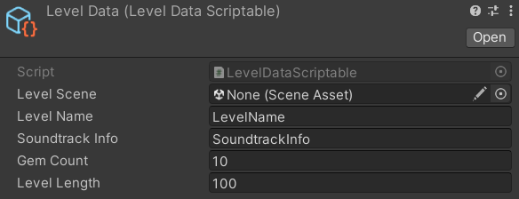

# 二. 关卡基础配置

我们在第一步创建好了关卡场景以及需要的配置文件，接下来我们开始设置创建的配置文件以及关卡内容

## (一) LevelData配置 💾
找到刚刚创建的LevelData文件，可以在Inspector中配置其参数

1. LevelScene 关卡的场景文件
2. LevelName 关卡名称
3. SoundtrackInfo 这里可以填入音乐名，作曲家等信息
4. GemCount 关卡中的宝石总量
5. LevelLength 关卡时长(秒)

## (二) 如何填入BeatmapData？ 🤔

DLSample提供了三种填入BeatmapData的方法

### 1. 通过TrackGrapher踩音
1. 找到Unity顶部工具栏中的DLSample，点击Tools -> TrackGrapher

### 2. 通过OSU谱面文件导入(Rescripting)
1. 找到Unity顶部工具栏中的DLSample，点击Tools -> BeatmapFromOsu
### 3.通过BeatmapCreator踩音
- 见下文

## (三) PathGrapherAsset配置 ✏️
### PathGrapher介绍
PathGrapher核心是由时间驱动的路径推演器，根据初始速度、重力和方向等初始参数，结合 BeatmapData 提供的时间点，步进计算出每个 Waypoint 的世界坐标和旋转，最终绘制在编辑器中。

#### 对路径元素的定义
- Waypoint： 它是 BeatmapData 中每一个时间点在 3D 空间中的具体投影。它由前一个点的状态 + 两个点之间的时间差 + 路径事件计算得出。

- PathSegment： 两个相邻 Waypoint 之间的区间。

- PathSection：Segment 内部由 PathEvent 切分出的物理恒定区间。

#### 路径事件系统
PathGrapher中的路径事件分为点性事件和段性事件
PointEvent (点性事件)：如 SpeedChangeEvent、GravityChangeEvent。在特定时刻改变物理状态，影响后续所有路径。
SegmentEvent (段性事件)：
JumpEvent：赋予角色向上初速度（相对于角色局部坐标系），产生抛物线。
TeleportEvent：切断当前连续路径，在目标位置重新生成坐标起点。

如图所示，PathGrapherAsset需要用户填入BeatmapData以及初始状态信息
## (四) 创建基础关卡